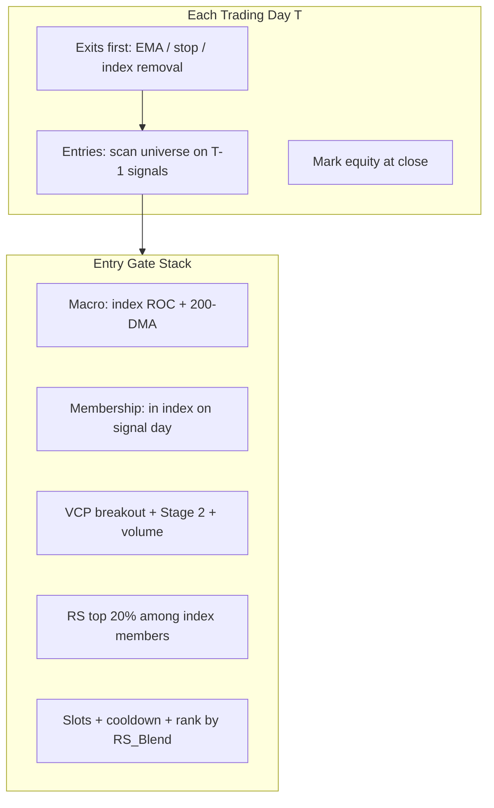

# State of the Project — Financially Free (Project Jist)

**Phase 1 status:** Historical backtesting and grid optimization are complete for **Nifty 50** and **Nifty Midcap 150**. The codebase does **not** yet include a Nifty Smallcap 250 universe, history module, or optimization artifacts. Your narrative mentions Smallcap as the third leg; in the repo, **Midcap 150 is the production target universe** for Phase 2.

---

## 1. System Architecture & Core Logic

The engine is a **two-layer rules system** (macro index gate + per-stock VCP/Stage 2) wrapped in a **shared-cash portfolio simulator** with next-day-open execution.



### Macro filter (Algorithm 1)

Applied to the **benchmark index ticker** for the selected universe (`SwingTradingAlgo.calculate_macro_roc`):

| Element | Math / rule |
|--------|-------------|
| **ROC lookback** | Month-end index close → `pct_change(lookback_roc)` × 100, forward-filled to daily. Column name is `ROC_18M` regardless of lookback. |
| **Nifty 50** | `^NSEI`, **18-month** ROC, tuned `max_roc = 45` |
| **Midcap 150** | `NIFTYMIDCAP150.NS`, **20-month** ROC, tuned `max_roc = 75` (default in code: 100) |
| **200-DMA regime** | `Close > rolling(200).mean()` → `Index_Above_200DMA` |
| **Entry gate** | `ROC < max_roc` **and** (if `require_index_trend=True`) index above 200-DMA |

**Warmup:** Download starts `lookback_roc + 3` months before `backtest_start` so ROC and 252-day stock windows are valid.

### Micro entry (Algorithm 2 + portfolio gates)

**Volatility contraction (VCP):**

- `Vol_10D = std(Close, 10)`, `Vol_20D = std(20)`, `Vol_40D = std(40)`
- `Is_Contracting = Vol_10D < Vol_20D < Vol_40D`
- **Breakout:** prior bar contracting **and** `Close > max(High, 20).shift(1)` **and** `Volume > 1.2 × avg(Volume, 50).shift(1)`
- Encoded as `VCP_Breakout`; Stage 2 required on **prior** bar via `.shift(1)`

**Stage 2 Trend Template** (`Stage_2_Uptrend` — all must hold):

- Close > SMA 150 and SMA 200
- SMA 150 > SMA 200
- SMA 50 > SMA 150 and SMA 200
- SMA 200 > SMA 200.shift(20)
- Close ≥ 75% of 52-week high (252-day rolling max)
- Close ≥ 130% of 52-week low (252-day rolling min)

**Volume (portfolio-level):** `Volume_Ratio = Volume / Vol_Avg_50D`; entry requires `Volume_Ratio ≥ min_volume_ratio` (1.0 midcap tuned, 1.2 Nifty tuned). VCP already enforces 1.2× on breakout day.

**Relative strength:**

- `Return_6M = pct_change(126)`, `Return_12M = pct_change(252)`
- `RS_Blend = 0.4 × Return_6M + 0.6 × Return_12M`
- On signal day, pool RS across **index members**; keep names ≥ `(1 - rs_top_pct)` quantile (default **top 20%**)
- When slots are limited, sort candidates by `RS_Blend` descending (replaces legacy volume ranking)

**Full entry** (`_entry_signal` + portfolio checks):

1. In historical index membership on signal day (`index_members_prev`)
2. Macro ROC and optional 200-DMA pass
3. `VCP_Breakout` true on prior bar (includes Stage 2)
4. `Volume_Ratio ≥ min_volume_ratio`
5. RS top-tier filter (if `rank_by_rs`)
6. Free slot, cash > 10% of `slot_size`, not in **cooldown**

**Execution:** Signal on **T−1** → buy at **T open**. Exits processed **before** entries each day.

### Exit protocol

| Exit type | Trigger (evaluated on T−1) | Fill |
|-----------|----------------------------|------|
| **Signal (primary)** | `exit_confirm_days` consecutive closes below **21-EMA** (`Exit_1` / `Exit_2` / `Exit_3`) | T open |
| **Stop loss** | `Close < Stop_Level_N` where `Stop_Level_N = min(Low, N).shift(1)` at entry; N ∈ {10, 20, 30} | T open |
| **Index removal** | Symbol not in index membership on T | T open |
| **End of backtest** | Open positions marked at last **close** (`still_open`) | Close |

Tuned runs use **`exit_confirm_days = 2`** (two closes below 21-EMA). Stops are optional (`use_stop_loss=True`); almost all real exits are **`signal`** (e.g. midcap: 155 signal, 3 stop, 2 index_removal in production trades file).

### Portfolio management

| Rule | Implementation |
|------|----------------|
| **Capital** | Single cash pool; initial default ₹10,00,000 |
| **Position sizing** | `slot_size = initial_capital / max_positions` (~20% with 5 slots); each entry `invest = min(cash, slot_size)` |
| **Max positions** | Default 5 (tuned for both universes) |
| **Cooldown** | No re-entry in same symbol for `cooldown_days` after exit; **10** Nifty, **0** Midcap |
| **Slot competition** | Highest `RS_Blend` wins when candidates exceed free slots |
| **Commission** | 0.1% per side (`commission_pct=0.001`) |
| **Benchmark** | Buy-and-hold same index ticker over identical window |

---

## 2. Data Pipeline & Universe Management

**Data source:** Yahoo Finance (`yfinance`) only — no broker or NSE API.

**Anti-survivorship pattern:**

1. **Point-in-time membership** — `get_yf_constituents(date)` returns members as of the last rebalance on or before `date`.
2. **Download union** — `all_yf_tickers_between(start, end)` downloads every symbol that was ever in the index during the window (including removed names like `YESBANK.NS`, `HDFC.NS`).
3. **Trade gate** — Entries only if the symbol was in the index on the signal day; forced exit on removal.

### Nifty 50 (`nifty50_history.py`)

- Rollback from current set through **18 semi-annual rebalances (2017–2025)**
- `NSE_TO_YF` map for current and historical names
- `NIFTY_50_TICKERS` in `swing_trading_algo.py` is **today's list only** — documented as not for backtests

### Nifty Midcap 150 (`nifty_midcap_history.py`)

- Current 150 from `data/midcap150_constituents.csv`
- **7 rebalances encoded** (Sep 2022 → Sep 2025) from NSE press PDFs under `data/nse_press/`; Mar 2023 from Feb 2023 notification
- `scripts/parse_midcap_rebalances.py` extracts add/remove lists from PDFs
- Known gaps: membership snapshots ~156–158 vs exactly 150; `GVT&D` skipped (no Yahoo ticker); **no encoded midcap rebalances before Sep 2022** — pre-2022 membership is inferred by rolling back from today + known events only

### Feeding the backtester

```text
all_yf_tickers_between(start, end)
  → prepare_universe()  # batch download + macro join once
  → per-ticker calculate_vcp_and_emas()
  → backtest_portfolio(prepared_universe=...)  # optimizer reuses one download
```

**Midcap backtest window:** `2019-01-01` → `2026-05-01` (aligned with `NIFTYMIDCAP150.NS` history on Yahoo).
**Nifty 50 window:** `2018-01-01` → `2026-05-01`.

---

## 3. The Evolution & Results

### Journey (what actually exists in the repo)

| Phase | Universe | Key code changes | Outcome |
|-------|----------|------------------|---------|
| **A — Baseline** | Nifty 50 | VCP + 18M ROC + volume rank; no Stage 2/RS | ~+88.6% return, −27.6% DD; lagged Nifty B&H (+129%) |
| **B — Quality filters** | Nifty 50 | Stage 2 + RS top 20% + RS slot ranking | Return ↓ (~+68%), DD ↓ (~−10.9%), win rate ↑ (~44%) |
| **C — Midcap universe** | Midcap 150 | `nifty_midcap_history.py`, 20M ROC, midcap macro/benchmark | Return ~2× vs filtered large-cap; still below index B&H |
| **D — Grid expansion** | Midcap | 288 combos (`rs_top_pct` 0.2/0.3, `stop_lookback` 30) | Best params unchanged vs narrower grid |
| **E — Production lock** | Midcap | Tuned config in `__main__`; full rebalance history | **~+157%** production vs **+170%** in-sample optimizer peak |
| **F — Smallcap 250** | — | **Not implemented** | Listed as optional next step in `CHANGES.md` only |

### Performance summary (optimized vs production tuned)

| Metric | Nifty 50 + Stage 2 + RS | Midcap 150 + Stage 2 + RS |
|--------|-------------------------|----------------------------|
| **Window** | 2018-01-01 → 2026-05-01 | 2019-01-01 → 2026-05-01 |
| **Optimizer best return** | **+68.49%** | **+169.66%** |
| **Optimizer max DD** | **−10.32%** | **−14.58%** |
| **Optimizer win rate** | **44.3%** (149 trades) | **51.0%** (145 trades) |
| **Index B&H** | **+129.04%** | **+250.74%** |
| **Alpha vs index** | **−60.55%** | **−81.08%** |
| **Production tuned return**† | ~**+68%** (matches optimizer; 149 closed trades) | **+157.45%** per `CHANGES.md` |
| **Production max DD**† | ~**−10.9%** | **−18.39%** |
| **Production win rate**† | **44.3%** | **~47.5–47.8%** (160 trades in CSV) |
| **Avg return / trade** | **+2.44%** | **+5.16%** |

†Midcap production figures from `CHANGES.md` (full 7-rebalance run); trade file shows 160 closed trades vs optimizer's 145 — slightly different trade count, same tuned parameters.

### Winning parameters (side-by-side)

| Parameter | Nifty 50 | Midcap 150 |
|-----------|----------|------------|
| `max_roc` | 45 | **75** |
| `lookback_roc` | 18 | **20** |
| `exit_confirm_days` | 2 | 2 |
| `cooldown_days` | **10** | **0** |
| `max_positions` | 5 | 5 |
| `min_volume_ratio` | 1.2 | **1.0** |
| `stop_lookback` | 20 | 20 |
| `rs_top_pct` | 0.20 | 0.20 |

### Why smaller capitalizations outperform (in this system)

1. **VCP payoff structure** — Minervini-style contraction-breakouts target **explosive continuation**; midcaps move farther per pivot than Nifty 50 names, so the same rules produce higher **average winner** (+5.16% vs +2.44% per trade).
2. **ROC ceiling** — Midcap optimizer prefers **`max_roc = 75`** vs **45** on Nifty: broader indices can stay "not overheated" longer in structural bull legs; a lower cap on large-cap macro was cutting entries too early or not the binding constraint.
3. **Cooldown = 0 on midcaps** — Trends re-accelerate after brief 21-EMA dips; **10-day cooldown** on Nifty reduced whipsaw but **cost midcap compounding** (optimizer: +169.7% vs +163.6% with cooldown 10).
4. **RS + Stage 2 in a larger pond** — Midcap 150 offers more Stage-2 candidates; **top-20% RS** concentrates in names already in institutional-quality uptrends; looser **30% RS** hurt returns.
5. **Concentration beats dilution** — **`max_positions = 5`** beat 10 on midcap total return despite more signals with 10 slots.
6. **Exits are EMA-driven, not stop-driven** — `stop_lookback` 10/20/30 ties at the top; risk control is mostly **Stage 2 + macro off-switch**, not trailing lows.

**Honest headline:** The system has **not** beaten buy-and-hold of its benchmark index on raw return in any completed universe. The edge is **risk-shaped**: materially lower max drawdown than naive index holding while capturing a large fraction of upside (especially midcap).

---

## 4. Current State vs. Initial Spec

`PROJECT_JIST.md` is a **pre-midcap snapshot**; `CHANGES.md` is the **current narrative**. Major deltas:

| Area | `PROJECT_JIST.md` (original) | Current codebase |
|------|------------------------------|------------------|
| Universes | Nifty 50 only | Nifty 50 + **Midcap 150** CLI (`midcap` / `midcap optimize`) |
| Stock quality | VCP + volume rank only | **Stage 2** + **RS blend** + RS slot competition |
| Midcap macro | Mentioned in docstring only | **20M ROC** on `NIFTYMIDCAP150.NS` |
| Optimizer | 96 combos, no `rs_top_pct` | Nifty 96; Midcap **288** combos |
| Default midcap `max_roc` | N/A | Code default **100**; production uses **75** |
| Ranking | `rank_by_volume` | **`rank_by_rs`** default True |
| Results docs | +88% / −27% Nifty without filters | Filtered Nifty ~+68% / ~−11%; Midcap production ~+157% |
| Smallcap | Footnote only | **Still absent** |

**Improvements beyond original design:** Point-in-time midcap rebalances, PDF parsing pipeline, dual-universe architecture, Minervini template fidelity, internal RS vs index peers.

**Gaps vs user story:** Smallcap 250 iteration is **planned, not shipped**; `prompt_context/swing_trading_algo.context.md` is **stale** (still says no midcap/Stage 2).

---

## 5. Technical Debt & Limitations

| Category | Limitation |
|----------|------------|
| **Universe history** | Midcap: only **7** rebalances from Sep 2022; **2019–2022** membership is synthetic rollback, not NSE-verified each semester. Nifty: manual rebalance tables, not official NSE files. |
| **Smallcap** | No `nifty_smallcap_history.py`, no smallcap index ticker wiring, no CSVs or optimizer output. |
| **Data quality** | Yahoo only; splits/corporate actions vary; delisted/bankrupt names may have gaps; min **270** rows to load a ticker. |
| **Execution model** | Next-day **open** fills; **no slippage** beyond 0.1% commission; no partial fills, gaps, or auction effects. |
| **Liquidity** | No ADV cap, no "position size vs volume" constraint — critical before real smallcap live trading. |
| **Optimization** | In-sample grid on same period; objective = **raw return** only (not Sharpe, Calmar, max DD). No walk-forward / holdout. |
| **Survivorship** | Union download helps, but bad Yahoo history on removed names still biases results. |
| **Membership drift** | Midcap snapshots **156–158** names vs 150; uneven rebalance once (16 in / 17 out). |
| **Naming / UX** | ROC column always `ROC_18M`; benchmark summary keys still say `nifty_return_pct` for midcap runs. |
| **Index vs stock macro** | Macro filter uses **same index as universe** — correct for midcap; no separate "Nifty regime + midcap hunting" mode. |
| **Live / broker** | No scheduling, alerts, position ledger, or API integration. |

---

## 6. Execution Roadmap (Phase 2)

A practical three-step path from research backtester to live paper trading, then broker execution:

### Step 1 — Daily EOD signal engine (research → operations)

**Goal:** One command after market close that answers: "What would we buy/sell tomorrow at open?"

- Extract a **`run_daily_signals(universe, config)`** module from `swing_trading_algo.py` (no full equity replay).
- **Incremental data:** Cache OHLCV locally (Parquet/SQLite); refresh only last N days + macro index.
- **Inputs:** Point-in-time constituents for **today** from `nifty_midcap_history` (extend pattern for Smallcap when ready).
- **Outputs:** `signals_YYYYMMDD.csv` — BUY candidates (ranked RS), SELL list (open positions: EMA exit, stop, removal), macro regime on/off.
- **Config:** Single YAML/JSON for tuned midcap params (`max_roc=75`, `cooldown=0`, etc.).
- **Validation:** Replay last 5 trading days and diff against `backtest_portfolio` trade log.

### Step 2 — Paper-trading state machine

**Goal:** Track real decisions without capital risk.

- **Position ledger:** `positions.json` — entry date/price, shares, stop level, universe membership at entry.
- **Corporate actions:** Basic split adjustment on stored entry prices.
- **EOD job:** Apply exits (signal/stop/removal) → then entries up to 5 slots with same ranking rules.
- **Reporting:** Daily P&L vs `NIFTYMIDCAP150.NS`, drawdown, open risk, trade journal aligned with `portfolio_trades_midcap.csv` schema.
- **Liquidity pre-filter (paper):** Drop candidates where `20-day avg daily value < X × intended position size` (e.g. 5–10×).
- **Human checkpoint:** Email/Telegram summary; no auto-orders yet.

### Step 3 — Broker API execution (production-shaped)

**Goal:** Automate orders with guardrails; still start with paper at broker if available.

- **Broker adapter** (Zerodha Kite / Angel / etc.): place MOO or limit-at-open with max slippage bps.
- **Order sizing:** `min(slot_size, cash, liquidity_cap)` where `liquidity_cap = pct × 20d avg volume × price`.
- **Risk kills:** Max daily new positions, macro off → no new buys, flatten on index below 200-DMA (configurable).
- **Reconciliation:** Fill prices vs assumed open; update ledger; alert on partial fills.
- **Smallcap gate:** Only after `nifty_smallcap_history.py` + liquidity rules proven on midcap paper for several months.

---

### Alignment checklist before live execution

| Item | Status |
|------|--------|
| Core VCP + Stage 2 + RS logic | ✅ Implemented |
| Point-in-time Nifty 50 | ✅ Strong (2017+) |
| Point-in-time Midcap 150 | ✅ Sep 2022+ verified; pre-2022 approximate |
| Optimized midcap config locked | ✅ In `__main__` tuned dict |
| Beats index B&H on return | ❌ No |
| Smallcap 250 | ❌ Not in repo |
| Live data / paper / broker | ❌ Phase 2 |

**Recommended immediate focus:** Ship **Step 1** on **Midcap 150 production config**; treat Smallcap as Phase 1b (history + liquidity study) only after paper midcap is stable.

---

*Generated May 2026 — reflects codebase scan of `swing_trading_algo.py`, `nifty50_history.py`, `nifty_midcap_history.py`, `PROJECT_JIST.md`, `CHANGES.md`, and optimization/trade CSVs.*
